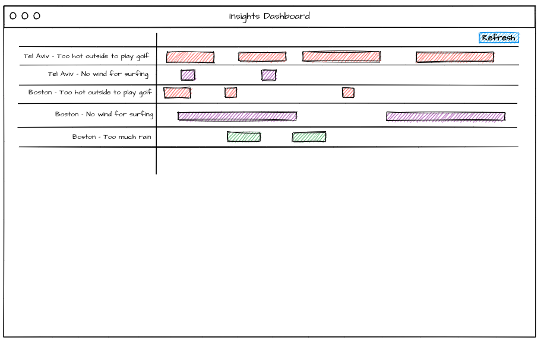
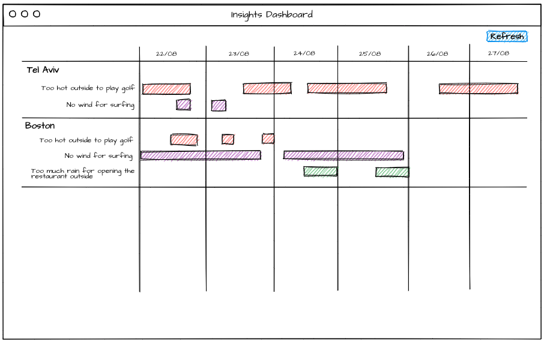

# Take Control over The Weather

## The Weather Impact Dashboard

In this exercise, you will create a weather dashboard that presents an impact of 
specific weather insights on locations of interest over a timeline.

For this purpose the repository contains:
 
1. A mock server that will represent our api. In order to run the server use `npm run api`. The api contains following routes:
    * `http://localhost:5000/locations` - will return the locations that we want to monitor on the dashboard
    * `http://localhost:5000/insights` - will return the insights that we have in the system
    * `http://localhost:5000/events` - events that happened to the locations based on the insights over time

2. State boilerplate - initial redux configuration

**We recommend forking this repository and use our template for quick bootstrapping.**

#### Required solution:

##### Simple

* Create a basic web application.
* This application should show a dashboard of locations and events happening for those locations
* Example of the final solution: 
* For the simple solution we want the dashboard to have the following features:
    * Each row in the dashboard represents Locations + Insight and the events happening over time
    * Each timeline of events related to the specific insight should have a dedicated color based on the insight's severity (choose colors as you wish) 
    * Clicking on refresh button will bring new events from the server

##### Advanced

* Example of the final solution: 
* For advanced solution we want to add 2 more features:
    * Hierarchy per Location
    * Dates Layer that will show the separation of dates

##### Bonus

Deploy your solution to a static web hosting service of your choice (such as: Heroku, Github, AWS S3, Netlify etc..) so it is publicly available.

#### After you finish:

Upload your code to Github, and share it with us. Notice: make it private, not public.
Make sure the app is ready to run by running `npm i`, `npm start` and `npm run api`.
Make sure the service API is well documented with README file, so we can try it and understand it.

#### Guidelines:

* Pay attention to software design and clean code (We are believers of the [SOLID](https://en.wikipedia.org/wiki/SOLID) design principals). 
* We also care about things like readability, maintainability, naming, and in general everything that makes the code easy to understand and extend. **Think about the app as it should be ready to be shipped to production.**
* You are free to add any libraries of your desire. 

Don't hesitate to contact us with any question.

**Good Luck!**

**The Tomorrow.io Team**
